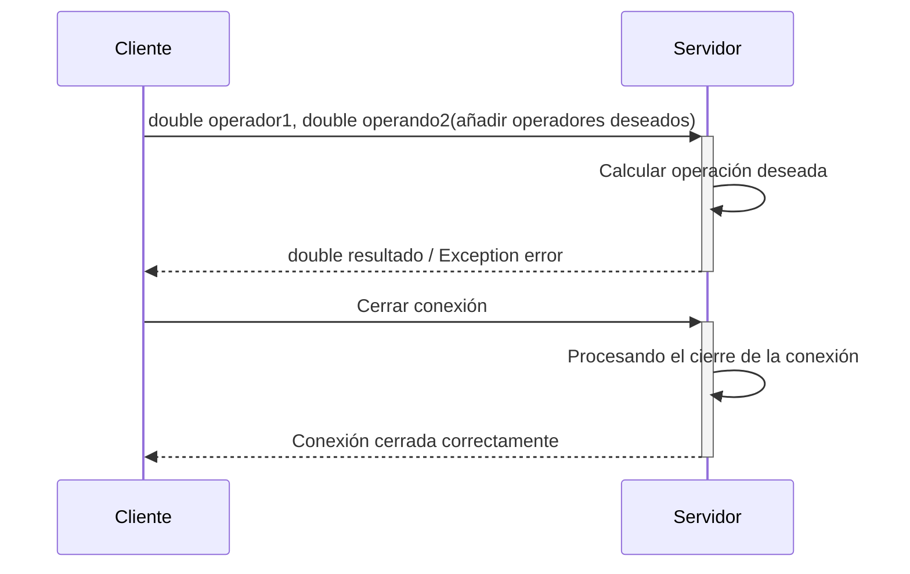

Define el protocolo de comunicación entre el cliente y el servidor en una aplicación de calculadora
basada en ese modelo de arquitectura. El cliente debe ser quien envíe la información
(operandos, tipo de operación y/o funciones adicionales (trigonométricas, financieras...)),
mientras que el servidor se encargará de realizar los cálculos y devolver el resultado.

